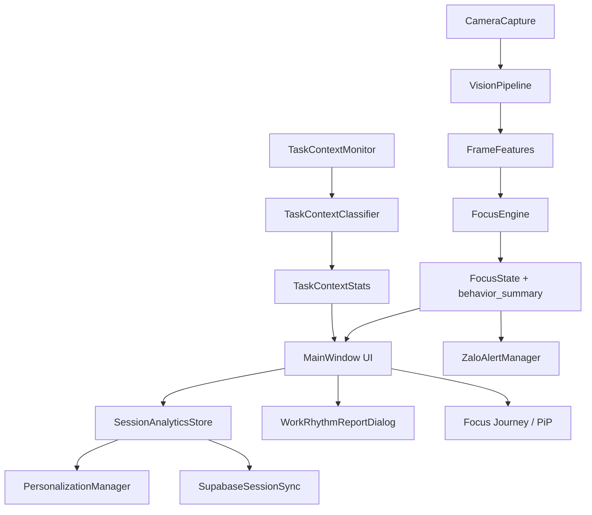

# Bao cao nghien cuu va mo ta ky thuat ung dung FocusGuardian

## 1. Tom tat

FocusGuardian la ung dung desktop ho tro theo doi nhip lam viec ca nhan bang webcam, tin hieu hanh vi, boi canh ung dung/tab dang mo, va du lieu lich su cua tung ho so nguoi dung. Ung dung khong khang dinh tuyet doi rang nguoi dung "dang tap trung" hay "mat tap trung"; thay vao do, he thong uoc luong cac tin hieu lam viec on dinh, rui ro lech khoi nhiem vu, dau hieu met moi, va do tin cay cua du lieu quan sat.

Muc tieu chinh cua he thong la:

- Ghi nhan nhung mau hanh vi lien quan den lam viec tren may tinh.
- Canh bao som khi co dau hieu lech nhiem vu, buon ngu, vang mat, hoac su dung dien thoai.
- Tao bao cao nhip lam viec theo ngay, tuan, thang.
- Ca nhan hoa thoi luong lam viec/nghi dua tren lich su tung nguoi dung.
- Dong bo tai khoan, cau hinh, baseline va du lieu phien qua Supabase.
- Gui canh bao realtime qua Zalo Bot khi nguoi dung cau hinh.

Huong tiep can cua app la "calm technology": theo doi nhe, khong chan cuong buc, khong can thiep sau vao he thong, va khong overclaim ve trang thai nhan thuc cua nguoi dung.

## 2. Pham vi khoa hoc va gioi han dien giai

Ung dung su dung cac chi bao hanh vi co the quan sat duoc tu camera va he dieu hanh:

- Huong dau, huong mat va do mo mat.
- Nhip chop mat, ti le nham mat va PERCLOS.
- Dau hieu viet tay/ghi chep qua ban tay.
- Dau hieu dien thoai neu bo phat hien co bang chung.
- Trang thai idle cua Windows.
- Ung dung/tab dang active theo metadata cua cua so.

Cac chi bao nay chi la proxy signal. Vi vay bao cao va UI nen dung cac cum tu an toan:

- "Tin hieu lam viec on dinh" thay cho "dang tap trung".
- "Lech khoi nhiem vu" thay cho "mat tap trung".
- "Muc san sang lam viec" thay cho "Focus Score".
- "Chua du tin cay" khi camera/anh sang/goc quay khong dam bao.

Gioi han quan trong:

- Webcam khong the biet y dinh that su cua nguoi dung.
- Trinh duyet co the khong expose URL/tab active qua Windows API. Arc, Chrome, Edge thuong tra ve window title; mot so truong hop chi tra ve "New Tab" hoac title cua cua so.
- He thong khong chup man hinh, khong doc noi dung trang web, va khong luu raw window title vao payload dong bo.
- PhoneDetector o che do heuristic la tin hieu phu, khong nen xem la bang chung tuyet doi.

## 3. Cau truc tong quan he thong



Bang module chinh:

| Module | Vai tro |
|---|---|
| `main.py` | Khoi tao config, auth gate, MainWindow, system tray, vong doi app. |
| `app/ui/main_window.py` | UI chinh, camera preview, score, thong ke, Journey, settings, session lifecycle. |
| `app/vision/camera.py` | Mo webcam, doc frame tren thread rieng, resize frame xu ly de giam CPU. |
| `app/vision/vision_pipeline.py` | MediaPipe face/hand, head pose, eye metrics, hand metrics, quality/confidence. |
| `app/logic/focus_engine.py` | State machine, hysteresis, score, behavior summary, uncertainty explanation. |
| `app/logic/task_context.py` | Doc app/tab active, phan loai lien quan nhiem vu/xao nhang/trung tinh/khong ro. |
| `app/logic/session_analytics.py` | Luu phien, tong hop report, ket noi personalization va Supabase. |
| `app/logic/personalization.py` | Baseline ca nhan, recommendation work/break, outlier trimming, weighted recent mean. |
| `app/logic/supabase_sync.py` | REST client dong bo sessions, baselines, events, profile settings. |
| `app/logic/supabase_user_store.py` | Luu tai khoan nguoi dung tren Supabase. |
| `app/logic/zalo_alerts.py` | Chong spam canh bao va gui Zalo theo episode trang thai. |
| `app/ui/work_rhythm_dialog.py` | Bao cao nhip lam viec ngay/tuan/thang. |
| `app/ui/journey_map_dialog.py` va `journey_pip.py` | Focus Journey, ban do, boarding, PiP. |

## 4. Luong hoat dong cua mot phien lam viec

1. Nguoi dung dang nhap bang tai khoan Supabase.
2. MainWindow tai cau hinh profile-scoped tu Supabase.
3. Nguoi dung bam bat dau.
4. Neu bat cau hoi thiet lap phien, app hien `SessionContextDialog`.
5. Neu nguoi dung chon Journey tu chon, app hien boarding pass/map; neu ca nhan hoa thi co the bo qua Journey.
6. CameraCapture mo webcam voi config hien tai.
7. VisionPipeline xu ly frame theo target FPS, sinh VisionResult.
8. MainWindow chuyen VisionResult thanh FrameFeatures.
9. FocusEngine cap nhat cua so thoi gian, state, score va behavior_summary.
10. TaskContextMonitor lay foreground app/window theo chu ky.
11. UI cap nhat trang thai, score, rui ro, Journey, thong bao.
12. ZaloAlertManager gui canh bao neu trang thai xau keo dai qua nguong va cooldown.
13. Khi dung phien, SessionAnalyticsStore luu session, cap nhat baseline, dong bo Supabase.

## 5. Cac state hanh vi chinh

| State | Y nghia an toan | Tin hieu thuong gap |
|---|---|---|
| `ON_SCREEN_READING` | Tin hieu lam viec on dinh | Co mat, dau/anh mat huong ve man hinh, khong co bang chung ro cua lech nhiem vu. |
| `OFFSCREEN_WRITING` | Lam viec on dinh ngoai man hinh | Dau cuoi xuong, co tay/viet, co glance len, phone risk thap. |
| `PHONE_DISTRACTION` | Lech khoi nhiem vu | Dau/mat cuoi xuong lau, it glance, diem viet thap, co phone evidence. |
| `DROWSY_FATIGUE` | Co dau hieu met | EAR thap, eye closure/perclos cao, idle tang, dau cuoi lau. |
| `AWAY` | Ngoai khung camera | Khong thay mat on dinh trong mot khoang thoi gian. |
| `UNCERTAIN` | Chua du tin cay | Tin hieu camera yeu, anh sang kem, mat khong on dinh, mau hanh vi mau thuan. |

State duoc lam mem bang hysteresis de tranh nhay lien tuc. App co `hysteresis_enter`, `hysteresis_exit`, `focused_state_hold_seconds` va co che giu trang thai on dinh khi tin hieu ngan han bi nhieu.

## 6. Bien dau vao tu camera: `FrameFeatures`

`FrameFeatures` la goi du lieu chinh gui vao FocusEngine moi frame.

| Bien | Kieu | Y nghia |
|---|---|---|
| `timestamp` | float | Thoi diem frame. |
| `face_detected` | bool | Co thay mat hay khong. |
| `head_pitch` | float/None | Goc cui/ngang dau; am hon la nhin xuong. |
| `head_yaw` | float/None | Goc quay trai/phai cua dau. |
| `head_roll` | float/None | Do nghieng dau. |
| `ear_avg` | float/None | Eye Aspect Ratio trung binh, thap khi mat nham. |
| `is_eye_closed` | bool | Mat co dang dong theo nguong EAR/closure. |
| `blink_detected` | bool | Co phat hien chop mat trong frame. |
| `hand_present` | bool | Co thay ban tay. |
| `hand_write_score` | float | 0-1, kha nang dang viet/ghi chep. |
| `hand_region` | str | Vi tri tay: upper/middle/lower. |
| `phone_present` | bool | Co bang chung dien thoai. |
| `idle_seconds` | float | Thoi gian khong co input chuot/phim Windows. |
| `eye_look_down`, `eye_look_up` | float/None | Tin hieu huong nhin doc tu blendshapes. |
| `eye_closure_level` | float/None | Muc do nham mat 0-1. |
| `perclos_ratio` | float/None | Ti le thoi gian mat dong trong cua so gan day. |
| `phone_confidence` | float/None | Do tin cay cua phone detector. |
| `vision_confidence` | float/None | Do tin cay tong hop cua camera/model. |
| `head_pose_confidence` | float/None | Tin cay cua solvePnP/head pose. |
| `eye_confidence` | float/None | Tin cay cua kenh mat. |
| `face_tracking_confidence` | float/None | Do on dinh cua face tracking. |
| `quality_warnings` | tuple | Canh bao chat luong: blur, low_light, no_face... |

## 7. Pipeline thi giac may tinh

VisionPipeline ket hop:

- FaceLandmarker: lay landmarks khuon mat.
- Head pose: solvePnP tu cac diem chuan nhu mui, mat, mieng, cam.
- Eye metrics: EAR, eye closure blendshapes, vertical gaze, blink, PERCLOS.
- HandLandmarker: tay, vung tay, write score, motion/stability.
- VisionQuality: do sang, blur, face visibility, component confidence.
- VisionCalibration: offset dau, baseline EAR, threshold mat dong theo tung profile.

Luong xu ly:

```text
Frame BGR -> Face/Hand landmark -> HeadPose/EyeMetrics/HandMetrics -> VisionQuality -> VisionResult -> FrameFeatures
```

Ung dung resize frame xu ly ve khoang `480x360` de giam tai CPU trong khi preview van co the hien thi `640x480`. PhoneDetector chay cach frame (`phone_detection_interval_frames`) de tranh tang latency.

## 8. FocusEngine: co che suy luan state va score

FocusEngine dung cua so thoi gian ngan va dai:

- `short_window`: mac dinh 10 giay, bat bien dong gan.
- `long_window`: mac dinh 30 giay, on dinh hoa xu huong.

He thong tinh `WindowStats`:

- `face_ratio`: ti le frame co mat.
- `head_down_ratio`: ti le dau cui.
- `max_continuous_head_down`: chuoi cui dau dai nhat.
- `num_glances_up`: so lan nhin len.
- `blink_rate_per_min`: nhip chop mat.
- `eye_closure_ratio`, `perclos_ratio`: dau hieu met/buon ngu.
- `avg_write_score`, `hand_lower_ratio`: bang chung ghi chep.
- `phone_ratio`: ti le co bang chung dien thoai.
- `avg_idle`, `max_idle`: thoi gian khong tuong tac may.

Sau do FocusEngine:

1. Tinh bang chung lam viec (`working_evidence`).
2. Tinh rui ro xao nhang (`distraction_severity`).
3. Tinh dau hieu met (`drowsiness_severity`).
4. Tinh do tin cay (`confidence_index`).
5. Chon intended state.
6. Ap dung hysteresis.
7. Cap nhat score bang mo hinh target + gioi han toc do tang/giam.

`behavior_summary` gom:

| Bien | Y nghia |
|---|---|
| `primary_state` | State hien tai. |
| `engagement_index` | Muc bang chung co lien quan den tac vu. |
| `fatigue_index` | Dau hieu met moi/strain. |
| `distraction_risk` | Rui ro lech nhiem vu tu camera/hanh vi. |
| `confidence_index` | Do tin cay cua camera/model/state. |
| `status_modifier` | Co the la `low_confidence`, `fatigued_but_working`, `possible_passive_attention`. |
| `explanation` | Giai thich ngan cho modifier. |

## 9. Digital Task Context: xem nguoi dung mo app/tab gi

Module `task_context.py` doc metadata foreground window bang Windows API:

- `GetForegroundWindow`: cua so active.
- `GetWindowTextW`: title cua cua so.
- `GetWindowThreadProcessId`: process id.
- `psutil` hoac `QueryFullProcessImageNameW`: process name.
- `EnumChildWindows`: doc them child-window text cho browser co an tab title, vi du Arc.

He thong phan loai:

| Nhom | Mo ta | Vi du |
|---|---|---|
| `task_related` | Co kha nang phuc vu cong viec | VS Code, Cursor, Notion, Docs, Sheets, GitHub, Figma, Teams, Zoom. |
| `distracting` | Co nguy co keo lech nhiem vu | TikTok, Shorts, Reels, Netflix, Steam, Roblox, Valorant, Shopee. |
| `neutral` | Trung tinh | Explorer, Settings, File. |
| `unknown` | Chua co rule du tin cay | App la, title khong ro. |
| `excluded` | Bi loai tru | FocusGuardian, notification/toast. |

Chi so:

```text
task_alignment_ratio = task_related_samples / valid_samples
distracting_ratio = distracting_samples / valid_samples
unknown_ratio = unknown_samples / valid_samples
risk_score = 0.62*distracting_ratio + 0.28*(1-task_alignment_ratio) + 0.10*unknown_ratio
```

Neu mau moi nhat la distracting, `risk_score` duoc nang toi thieu len 0.72 de UI va notification phan ung nhanh.

Quyen rieng tu:

- App co doc raw window title trong bo nho de phan loai.
- Payload an toan khong luu `window_title` va khong luu `context_text`.
- Bao cao chi luu app/process/category/risk tong hop.

## 10. Thong bao context thay cho chan

Ung dung hien khong chan website/app va khong sua DNS/hosts. Khi active app/tab bi phan loai `distracting`, app:

- Cap nhat thanh "Rui ro phan tam".
- Gui notification tray neu `enable_notifications` va `notify_distraction` bat.
- Ghi event `context_alert` voi `action = notification_only`.
- Ton trong cooldown `task_context_alert_cooldown_seconds` de tranh spam.

Mac dinh:

- `task_context_alert_enabled = true`
- `task_context_alert_threshold = 0.68`
- `task_context_alert_cooldown_seconds = 120`

## 11. Ca nhan hoa va baseline

Personalization duoc thiet ke de tra loi cau hoi: "Neu thoi quen nguoi dung thay doi, baseline cu co con dung khong?"

Co che:

- Phien duoi 10 phut khong anh huong baseline.
- Phien 10-20 phut duoc tin dan.
- Phien hoan thanh qua thap so voi ke hoach bi down-weight.
- Du lieu moi duoc uu tien bang weighted recent mean.
- Ngoai lai duoc giam anh huong bang IQR trimming.
- Baseline co the reset theo profile, khong xoa tai khoan va khong xoa config toan app.

Bien baseline chinh:

| Bien | Y nghia |
|---|---|
| `session_count` | So phien hop le cho baseline. |
| `personalization_weight` | Muc do app nen tin baseline ca nhan. |
| `adaptation_stage` | `cold_start`, `hybrid`, `personalized`. |
| `blink_rate_baseline` | Nhip chop mat tham chieu. |
| `avg_ear_baseline` | EAR tham chieu. |
| `eye_closure_ratio_baseline` | Ti le nham mat tham chieu. |
| `perclos_baseline` | PERCLOS tham chieu. |
| `average_focus_score_baseline` | Muc san sang trung binh lich su. |
| `average_distraction_density` | Mat do lech nhiem vu trong lich su. |
| `average_fatigue_onset_minutes` | Thoi diem met moi thuong xuat hien. |
| `recommended_work_minutes` | Goi y thoi luong lam viec. |
| `recommended_break_minutes` | Goi y thoi luong nghi. |

Giai doan:

- `cold_start`: <3 phien, chu yeu dung mac dinh.
- `hybrid`: 3-7 phien, tron mac dinh va du lieu ca nhan.
- `personalized`: >7 phien, tin baseline ca nhan hon.

## 12. Bao cao nhip lam viec

Khi nguoi dung bam "Nhip lam viec hom nay", app mo `WorkRhythmReportDialog`. Bao cao gom ngay/tuan/thang, chon cac bieu do phu hop de giam tai thong tin:

- Tong thoi gian phien.
- Thoi gian lam viec on dinh.
- Rui ro phan tam.
- Dau hieu met.
- Task alignment.
- So lan chuyen app/context.
- Trend muc san sang lam viec.
- Goi y work/break cho phien sau.

Muc tieu cua bao cao khong phai xep hang nguoi dung, ma la giup ho thay mau nhip lam viec: luc nao on dinh, luc nao de lech, luc nao nen nghi ngan.

## 13. Focus Journey

Focus Journey la lop trai nghiem hoa thoi gian lam viec:

- Nguoi dung co the chon ca nhan hoa hoac tu chon.
- Che do ca nhan hoa lay thoi luong tu personalization.
- Che do tu chon hien route may bay theo thoi luong.
- Map lon hien hanh trinh, tien do, quang duong con lai.
- PiP chi hien khi Journey dang chay va main/map bi an/minimize.

Y nghia:

- Bien phien lam viec thanh mot muc tieu co mo dau/ket thuc ro.
- Giam cam giac "ngoi vao ban vo han".
- Ho tro nguoi dung hinh dung tien do ma khong can nhin dong ho lien tuc.

## 14. Zalo Alerts

Zalo Alerts la kenh canh bao ngoai app. He thong chi gui khi:

- Zalo Alerts da bat.
- Da co `zalo_chat_id`.
- Trang thai xau keo dai qua `zalo_distraction_confirm_seconds`.
- Chua vi pham cooldown `zalo_state_cooldown_seconds`.
- Kenh canh bao cho state do dang bat.

Bien cau hinh:

| Bien | Mac dinh | Y nghia |
|---|---:|---|
| `enable_zalo_alerts` | false | Bat/tat Zalo Alerts. |
| `zalo_chat_id` | "" | Chat ID sau khi ket noi bot. |
| `zalo_api_timeout_seconds` | 8 | Timeout API. |
| `zalo_alert_cooldown_minutes` | 2 | Cooldown than thien cho UI. |
| `zalo_distraction_confirm_seconds` | 5 | State xau can keo dai bao lau moi gui. |
| `zalo_state_cooldown_seconds` | 120 | Cooldown giua hai alert cung episode. |
| `zalo_alert_on_distraction` | true | Gui khi lech nhiem vu. |
| `zalo_alert_on_drowsy` | true | Gui khi co dau hieu met. |
| `zalo_alert_on_phone` | true | Gui khi co phone evidence. |
| `zalo_alert_on_away` | true | Gui khi vang mat. |
| `zalo_alert_on_break_reminder` | true | Gui nhac nghi. |

## 15. Supabase va du lieu dong bo

Supabase thay Google Sheets de tang do on dinh. Cac nhom du lieu:

| Bang/chuc nang | Noi dung |
|---|---|
| `focusguardian_users` | Tai khoan, username, password hash, profile. |
| `focusguardian_sessions` | Ban ghi phien lam viec. |
| `focusguardian_user_baselines` | Baseline ca nhan va recommendation. |
| `focusguardian_focus_events` | Event phien, checkin, alert, recovery. |
| `focusguardian_profile_settings` | Settings theo profile. |

App van co cache local trong thu muc `analytics/` de tiep tuc hoat dong khi Supabase tam thoi khong san sang, tuy nhien dang nhap va dong bo chinh dua tren Supabase.

## 16. Cau hinh quan trong

| Bien | Mac dinh | Tac dong |
|---|---:|---|
| `resolution` | `640x480` | Do phan giai camera xin tu webcam. |
| `fps` | 15 | FPS camera mong muon. |
| `vision_target_fps` | 8 | FPS xu ly vision thuc te. |
| `camera_preview_fps` | 12 | FPS preview UI. |
| `phone_detection_interval_frames` | 4 | Chay phone detector cach N frame. |
| `task_context_sample_interval_seconds` | 8 | Chu ky lay mau app/tab. |
| `break_interval_minutes` | 25 | Work interval mac dinh. |
| `break_duration_minutes` | 5 | Break duration mac dinh. |
| `theme_mode` | dark | Giao dien mac dinh. |
| `enable_personalization` | true | Bat ca nhan hoa. |
| `auto_apply_personalization` | true | Tu ap dung goi y. |
| `enable_supabase_sync` | true | Dong bo Supabase. |
| `session_report_show_on_stop` | true | Hien bao cao khi dung phien. |

## 17. Cau hinh toi thieu de chay muot

Muc "muot" o day duoc hieu la preview on dinh, xu ly vision 6-8 FPS, UI khong giat dang ke, va CPU khong bi day 100% lien tuc.

### Toi thieu khuyen nghi

| Thanh phan | Muc khuyen nghi |
|---|---|
| He dieu hanh | Windows 10/11 64-bit. |
| CPU | Intel Core i5 gen 8 tro len, Ryzen 3/5 doi 3000 tro len, hoac tuong duong. |
| RAM | 8 GB tro len. |
| GPU | Khong bat buoc; MediaPipe/TFLite chay CPU duoc. |
| Webcam | 640x480 hoac 720p, 15 FPS tro len. |
| Luu tru | SSD khuyen nghi de app mo nhanh va ghi analytics on dinh. |
| Mang | Can internet neu dung Supabase/Zalo; camera tracking co the chay local neu da dang nhap/cache phu hop. |

### Cau hinh yeu hon van co the chay

| Thanh phan | Cach giam tai |
|---|---|
| CPU 2-4 nhan cu | Giam `vision_target_fps` ve 4-6. |
| RAM 4 GB | Tat app nen nang, giu `resolution=640x480`. |
| Webcam yeu | Dung anh sang tot, tranh nguoc sang. |
| CPU hay nong | Tang `phone_detection_interval_frames`, dung heuristic/stub, tat YOLO. |
| Lag khi Journey map | Dung ca nhan hoa khong Journey hoac minimize map/PiP. |

### Cau hinh de demo truoc giam khao

- Laptop Windows 10/11.
- CPU i5/Ryzen 5 tro len.
- RAM 8-16 GB.
- Webcam laptop hoac webcam USB 720p.
- Chay app o che do dark.
- Camera 640x480, 15 FPS.
- `vision_target_fps=8`, `camera_preview_fps=12`.
- Ket noi internet on dinh neu demo Supabase/Zalo.

## 18. Toi uu cho may cau hinh thap

Nhung diem da co trong app:

- CameraCapture chay thread rieng, buffer size 1 de giam latency.
- Frame xu ly resize ve `process_width <= 480`, `process_height <= 360`.
- Vision processing co target FPS rieng, khong bat buoc xu ly moi preview frame.
- PhoneDetector co interval frame va co mode heuristic/stub.
- UI preview FPS tach voi vision target FPS.
- FocusEngine dung cua so thoi gian/hysteresis de giam nhay sai khi frame rate thap.
- Task context sample 8 giay/lau hon, rat nhe so voi vision.

Khuyen nghi setting cho may yeu:

```json
{
  "resolution": "640x480",
  "fps": 15,
  "vision_target_fps": 6,
  "camera_preview_fps": 10,
  "phone_detection_mode": "heuristic",
  "phone_detection_interval_frames": 6,
  "task_context_sample_interval_seconds": 8
}
```

## 19. Ke hoach danh gia khoa hoc

De chung minh tinh hop ly, nen danh gia app theo 4 lop:

1. Do tin cay camera/model:
   - Ti le frame co mat.
   - Vision confidence trung binh.
   - So lan `UNCERTAIN` do low confidence.

2. Do phu hop state:
   - Ghi nhan state du doan.
   - Nguoi quan sat/nguoi dung gan nhan mau phien.
   - Tinh confusion matrix giua nhan va state.

3. Do huu ich cua ca nhan hoa:
   - So phien hop le.
   - Thay doi recommended work/break.
   - Ti le nguoi dung chap nhan goi y.

4. Do huu ich cua bao cao:
   - Nguoi dung co hieu ly do minh bi nhac khong.
   - Bao cao ngay/tuan/thang co giup dieu chinh thoi quen khong.

Module `scientific_validation.py` da co nen tang de tao bao cao do chinh xac model, ghi state prediction va phuc vu danh gia sau nay.

## 20. Rui ro sai so va cach giam

| Rui ro | Nguyen nhan | Cach giam |
|---|---|---|
| Nhan sai "met" khi nguoi dung doc tai lieu | Mat it chop, idle cao | Dung modifier `possible_passive_attention`, khong khang dinh tuyet doi. |
| Nhan sai phone khi nguoi dung viet tay | Dau cui lau | Ket hop hand_write_score, glance_up, phone_confidence. |
| `UNCERTAIN` cao | Anh sang yeu, blur, mat ngoai khung | Hien giai thich do tin cay, huong dan chinh camera. |
| Browser khong expose tab | Arc/Chrome UI an title | Doc window title + child text; neu van khong co thi phan loai unknown. |
| Baseline cu loi thoi | Thoi quen nguoi dung doi | Recent weighting, outlier trimming, reset baseline theo profile. |
| CPU qua tai | FPS/phone detector qua cao | Giam vision_target_fps, tang phone interval, resize frame. |

## 21. Ket luan

FocusGuardian la ung dung ho tro nhan thuc ve nhip lam viec, khong phai cong cu phan quyet "tap trung" tuyet doi. Gia tri chinh cua app nam o viec ket hop nhieu kenh tin hieu: camera, hanh vi mat/dau/tay, idle Windows, app/tab dang mo, lich su ca nhan, va phan hoi nguoi dung. Cach thiet ke nay giup app vua huu ich trong thuc te, vua co the giai thich truoc giam khao bang ngon ngu nghien cuu: moi ket luan deu di kem muc do tin cay, gioi han quan sat, va co che giam sai so.

Huong phat trien tiep theo:

- Them UI xem raw confidence/reason cho nguoi dung nang cao.
- Them bo gan nhan thu cong de danh gia state.
- Mo rong dictionary app/tab theo tung nganh nghe.
- Cai thien Arc/browser tab detection neu co extension/API hop le.
- Lam dashboard khoa hoc hon cho validation va confusion matrix.
