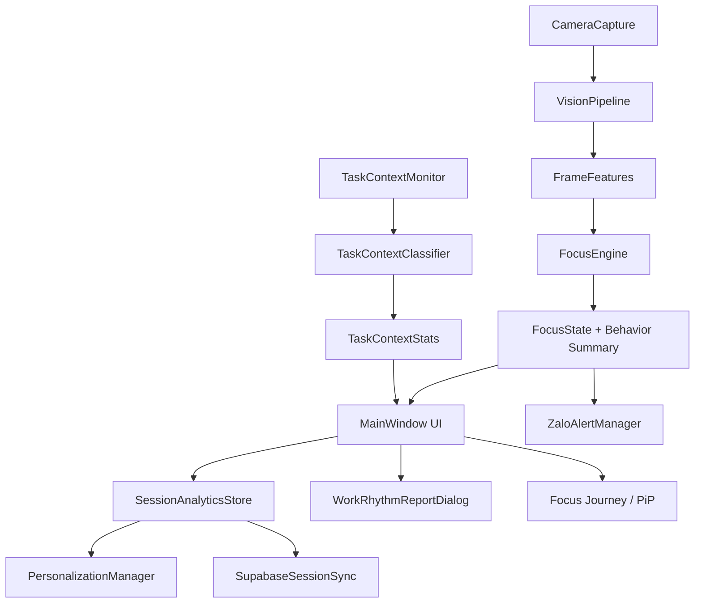

# Báo cáo nghiên cứu và mô tả kỹ thuật ứng dụng

## 1. Tóm tắt

FocusGuardian là ứng dụng desktop hỗ trợ người dùng quan sát nhịp làm việc cá nhân thông qua webcam, tín hiệu hành vi, trạng thái ứng dụng/tab đang mở, lịch sử phiên làm việc và dữ liệu cá nhân hóa theo từng hồ sơ. Ứng dụng không khẳng định tuyệt đối rằng người dùng "đang tập trung" hay "mất tập trung"; thay vào đó, hệ thống ước lượng các tín hiệu có thể quan sát được như mức làm việc ổn định, rủi ro lệch khỏi nhiệm vụ, dấu hiệu mệt mỏi và độ tin cậy của dữ liệu đầu vào.

Mục tiêu chính của hệ thống:

- Ghi nhận những mẫu hành vi liên quan đến quá trình làm việc trên máy tính.
- Cảnh báo sớm khi có dấu hiệu lệch nhiệm vụ, buồn ngủ, vắng mặt hoặc sử dụng điện thoại.
- Tạo báo cáo nhịp làm việc theo ngày, tuần và tháng.
- Cá nhân hóa thời lượng làm việc/nghỉ dựa trên lịch sử từng người dùng.
- Đồng bộ tài khoản, cài đặt, baseline và dữ liệu phiên qua Supabase.
- Gửi cảnh báo realtime qua Zalo Bot khi người dùng bật cấu hình này.

Cách tiếp cận của FocusGuardian là hỗ trợ nhận thức, không cưỡng chế. App ưu tiên thông báo nhẹ, giải thích rõ độ tin cậy và tránh can thiệp sâu vào hệ thống như chặn DNS, sửa file hosts hoặc ép đóng ứng dụng.

## 2. Phạm vi khoa học và giới hạn diễn giải

Ứng dụng sử dụng các chỉ báo hành vi có thể quan sát được:

- Hướng đầu, hướng mắt và mức mở/nhắm mắt.
- Nhịp chớp mắt, tỉ lệ nhắm mắt và PERCLOS.
- Dấu hiệu viết tay hoặc ghi chép thông qua dữ liệu bàn tay.
- Dấu hiệu điện thoại nếu bộ phát hiện có bằng chứng.
- Trạng thái idle của Windows.
- Ứng dụng hoặc tab đang active qua metadata của cửa sổ.

Các chỉ báo này là tín hiệu gián tiếp, không phải bằng chứng tuyệt đối về trạng thái nhận thức. Vì vậy, ngôn ngữ trong app được thiết kế theo hướng thận trọng:

| Cách nói nên dùng | Cách nói nên tránh |
|---|---|
| Tín hiệu làm việc ổn định | Bạn chắc chắn đang tập trung |
| Lệch khỏi nhiệm vụ | Bạn mất tập trung |
| Mức sẵn sàng làm việc | Focus Score như một kết luận tuyệt đối |
| Chưa đủ tin cậy | Không thấy mặt nên chắc chắn không làm việc |
| Có dấu hiệu mệt | Bạn đang buồn ngủ chắc chắn |

Giới hạn quan trọng:

- Webcam không thể biết ý định thật sự của người dùng.
- Trình duyệt có thể không cung cấp URL/tab active qua Windows API.
- Arc, Chrome, Edge và các trình duyệt Chromium thường chỉ cung cấp window title hoặc text của child window, không phải dữ liệu trang đầy đủ.
- App không chụp màn hình, không đọc nội dung trang web và không lưu raw window title vào payload đồng bộ.
- PhoneDetector ở chế độ heuristic chỉ là tín hiệu phụ, không nên xem là bằng chứng chắc chắn.

## 3. Kiến trúc tổng quan



Các module chính:

| Module | Vai trò |
|---|---|
| `main.py` | Khởi tạo cấu hình, đăng nhập, MainWindow, system tray và vòng đời ứng dụng. |
| `app/ui/main_window.py` | Giao diện chính, camera preview, session lifecycle, Journey, settings và báo cáo. |
| `app/vision/camera.py` | Mở webcam, đọc frame trên thread riêng, resize frame xử lý để giảm tải CPU. |
| `app/vision/vision_pipeline.py` | Xử lý face/hand landmarks, head pose, eye metrics, hand metrics và quality/confidence. |
| `app/logic/focus_engine.py` | State machine, hysteresis, tính score, behavior summary và uncertainty explanation. |
| `app/logic/task_context.py` | Đọc ứng dụng/tab active và phân loại task-related, distracting, neutral hoặc unknown. |
| `app/logic/session_analytics.py` | Lưu phiên, tổng hợp báo cáo, kết nối personalization và Supabase. |
| `app/logic/personalization.py` | Tạo baseline cá nhân, khuyến nghị work/break, trimming outlier và weighted recent mean. |
| `app/logic/supabase_sync.py` | Đồng bộ sessions, baselines, events và profile settings lên Supabase. |
| `app/logic/supabase_user_store.py` | Lưu và xác thực tài khoản người dùng bằng Supabase. |
| `app/logic/zalo_alerts.py` | Quản lý cooldown, episode và gửi cảnh báo qua Zalo Bot. |
| `app/ui/work_rhythm_dialog.py` | Hiển thị báo cáo nhịp làm việc ngày, tuần, tháng. |
| `app/ui/journey_map_dialog.py` và `app/ui/journey_pip.py` | Trải nghiệm Focus Journey, bản đồ, chọn ghế, PiP. |

## 4. Luồng hoạt động của một phiên làm việc

1. Người dùng đăng nhập bằng tài khoản được lưu trên Supabase.
2. App tải cài đặt theo profile từ Supabase và cache cục bộ.
3. Người dùng nhấn bắt đầu phiên hoặc đi qua Focus Journey.
4. CameraCapture mở webcam và đọc frame.
5. VisionPipeline trích xuất dữ liệu mặt, mắt, đầu, tay và chất lượng ảnh.
6. Dữ liệu được chuyển thành `FrameFeatures`.
7. FocusEngine cập nhật state hiện tại và các chỉ số hành vi.
8. TaskContextMonitor lấy mẫu app/tab đang active theo chu kỳ.
9. MainWindow cập nhật UI, score breakdown và trạng thái cảnh báo.
10. Nếu bật Zalo Alerts, app gửi cảnh báo khi state xấu kéo dài đủ lâu.
11. Khi dừng phiên, SessionAnalyticsStore lưu phiên, cập nhật baseline và đồng bộ Supabase.
12. Người dùng có thể mở báo cáo nhịp làm việc để xem kết quả ngày, tuần, tháng.

## 5. Các trạng thái hành vi chính

| State | Cách diễn giải trong UI | Ý nghĩa kỹ thuật |
|---|---|---|
| `ON_SCREEN_READING` | Tín hiệu làm việc ổn định | Có mặt, hướng đầu/mắt về màn hình, chưa thấy dấu hiệu rõ của mệt mỏi hoặc lệch nhiệm vụ. |
| `OFFSCREEN_WRITING` | Làm việc ổn định ngoài màn hình | Đầu cúi xuống nhưng có bằng chứng viết/ghi chép, có glance lên và phone risk thấp. |
| `PHONE_DISTRACTION` | Lệch khỏi nhiệm vụ | Có dấu hiệu cúi đầu lâu, ít glance, writing evidence thấp hoặc có phone evidence. |
| `DROWSY_FATIGUE` | Có dấu hiệu mệt | EAR thấp, eye closure/PERCLOS tăng, idle tăng hoặc đầu cúi lâu. |
| `AWAY` | Ngoài khung camera | Không thấy mặt ổn định trong một khoảng thời gian. |
| `UNCERTAIN` | Chưa đủ tin cậy | Dữ liệu camera yếu, ánh sáng kém, mặt không ổn định hoặc tín hiệu mâu thuẫn. |

FocusEngine có hysteresis để tránh state nhảy liên tục. Hệ thống chỉ chuyển state khi bằng chứng đủ ổn định qua một khoảng thời gian, thay vì phản ứng quá mạnh với một frame đơn lẻ.

## 6. Biến đầu vào từ camera: `FrameFeatures`

`FrameFeatures` là gói dữ liệu chính được gửi vào FocusEngine mỗi frame.

| Biến | Kiểu | Ý nghĩa |
|---|---|---|
| `timestamp` | float | Thời điểm frame. |
| `face_detected` | bool | Có thấy mặt hay không. |
| `head_pitch` | float/None | Góc cúi/ngẩng đầu. Giá trị thấp hơn thường biểu thị nhìn xuống. |
| `head_yaw` | float/None | Góc quay trái/phải của đầu. |
| `head_roll` | float/None | Độ nghiêng đầu. |
| `ear_avg` | float/None | Eye Aspect Ratio trung bình, thấp khi mắt nhắm. |
| `is_eye_closed` | bool | Mắt có đang đóng theo ngưỡng EAR/closure. |
| `blink_detected` | bool | Có phát hiện chớp mắt trong frame. |
| `hand_present` | bool | Có thấy bàn tay. |
| `hand_write_score` | float | Xác suất tương đối cho hành vi viết/ghi chép, trong khoảng 0-1. |
| `hand_region` | str | Vùng bàn tay: upper, middle hoặc lower. |
| `phone_present` | bool | Có bằng chứng điện thoại. |
| `idle_seconds` | float | Thời gian không có input chuột/phím từ Windows. |
| `eye_look_down` | float/None | Tín hiệu hướng nhìn xuống từ mắt. |
| `eye_look_up` | float/None | Tín hiệu hướng nhìn lên. |
| `eye_closure_level` | float/None | Mức độ nhắm mắt ước lượng, trong khoảng 0-1. |
| `perclos_ratio` | float/None | Tỉ lệ thời gian mắt đóng trong cửa sổ gần đây. |
| `phone_confidence` | float/None | Độ tin cậy của phone detector. |
| `vision_confidence` | float/None | Độ tin cậy tổng hợp của pipeline thị giác. |
| `head_pose_confidence` | float/None | Độ tin cậy của head pose. |
| `eye_confidence` | float/None | Độ tin cậy của kênh mắt. |
| `face_tracking_confidence` | float/None | Độ ổn định của việc theo dõi khuôn mặt. |
| `quality_warnings` | tuple | Cảnh báo chất lượng như low light, blur, no face. |

## 7. Pipeline thị giác máy tính

VisionPipeline kết hợp nhiều lớp xử lý:

- FaceLandmarker: lấy landmarks khuôn mặt.
- Head pose: ước lượng hướng đầu bằng các điểm chuẩn như mũi, mắt, miệng, cằm.
- Eye metrics: EAR, eye closure, vertical gaze, blink và PERCLOS.
- HandLandmarker: phát hiện bàn tay, vùng tay, writing score và motion/stability.
- VisionQuality: đánh giá ánh sáng, độ mờ, face visibility và confidence từng thành phần.
- VisionCalibration: lưu offset đầu, baseline EAR và threshold mắt nhắm theo từng profile.

Luồng xử lý:

```text
Frame BGR -> Face/Hand landmarks -> HeadPose/EyeMetrics/HandMetrics -> VisionQuality -> VisionResult -> FrameFeatures
```

Để tối ưu máy yếu, app resize frame xử lý về khoảng `480x360`, tách FPS preview và FPS xử lý vision. PhoneDetector không chạy mọi frame mà chạy theo `phone_detection_interval_frames` để giảm tải CPU.

## 8. FocusEngine: suy luận state và tính chỉ số

FocusEngine sử dụng hai cửa sổ thời gian:

| Thành phần | Ý nghĩa |
|---|---|
| `short_window` | Bắt biến động gần, mặc định khoảng 10 giây. |
| `long_window` | Ổn định hóa xu hướng, mặc định khoảng 30 giây. |

Từ các frame gần đây, hệ thống tính `WindowStats`:

| Biến | Ý nghĩa |
|---|---|
| `face_ratio` | Tỉ lệ frame có mặt. |
| `head_down_ratio` | Tỉ lệ thời gian đầu cúi. |
| `max_continuous_head_down` | Chuỗi cúi đầu liên tục dài nhất. |
| `num_glances_up` | Số lần nhìn lên. |
| `blink_rate_per_min` | Nhịp chớp mắt mỗi phút. |
| `eye_closure_ratio` | Tỉ lệ mắt đóng. |
| `perclos_ratio` | Tỉ lệ thời gian mắt đóng trong cửa sổ gần đây. |
| `avg_write_score` | Bằng chứng trung bình cho hành vi viết. |
| `hand_lower_ratio` | Tỉ lệ tay ở vùng thấp, hỗ trợ nhận diện ghi chép. |
| `phone_ratio` | Tỉ lệ frame có bằng chứng điện thoại. |
| `avg_idle` | Idle trung bình. |
| `max_idle` | Idle dài nhất trong cửa sổ. |

Sau đó FocusEngine:

1. Tính bằng chứng làm việc (`working_evidence`).
2. Tính rủi ro lệch nhiệm vụ (`distraction_severity`).
3. Tính dấu hiệu mệt (`drowsiness_severity`).
4. Tính độ tin cậy (`confidence_index`).
5. Chọn state dự kiến.
6. Áp dụng hysteresis.
7. Cập nhật mức sẵn sàng làm việc bằng target score và giới hạn tốc độ tăng/giảm.

`behavior_summary` gồm các biến quan trọng:

| Biến | Ý nghĩa |
|---|---|
| `primary_state` | State hiện tại. |
| `engagement_index` | Mức bằng chứng liên quan đến tác vụ. |
| `fatigue_index` | Dấu hiệu mệt mỏi hoặc strain. |
| `distraction_risk` | Rủi ro lệch nhiệm vụ từ camera/hành vi. |
| `confidence_index` | Độ tin cậy của dữ liệu camera/model/state. |
| `status_modifier` | Modifier như `low_confidence`, `fatigued_but_working`, `possible_passive_attention`. |
| `explanation` | Giải thích ngắn cho modifier. |

## 9. Giải thích độ tin cậy

App có cơ chế giải thích vì sao một state hoặc chỉ số có thể chưa đủ chắc chắn. Dữ liệu sử dụng:

- `vision_confidence`
- `eye_confidence`
- `head_pose_confidence`
- `face_tracking_confidence`
- `quality_warnings`
- `VisionQuality.overall_confidence`
- `VisionQuality.lighting_quality`
- `VisionQuality.blur_score`
- `VisionQuality.face_visibility`

Kết quả giải thích có dạng:

```json
{
  "confidence_level": "good | medium | low",
  "confidence_index": 0.0,
  "reasons": [],
  "suggestions": []
}
```

Ví dụ diễn giải:

| Điều kiện | Lý do |
|---|---|
| `vision_confidence` thấp | Dữ liệu camera chưa đủ tin cậy. |
| `face_tracking_confidence` thấp | Không thấy mặt ổn định. |
| `eye_confidence` thấp | Tín hiệu mắt chưa rõ. |
| `low_light` hoặc `dark` | Ánh sáng yếu. |
| `blur` | Hình ảnh hơi mờ. |
| `no_face` | Người dùng đang ngoài khung camera. |

Điểm quan trọng là app không dùng phần này để quy kết người dùng, mà dùng để giải thích giới hạn quan sát.

## 10. Digital Task Context: xem người dùng đang bật app/tab gì

Module `task_context.py` đọc metadata của foreground window bằng Windows API:

- `GetForegroundWindow`: lấy cửa sổ active.
- `GetWindowTextW`: lấy title cửa sổ.
- `GetWindowThreadProcessId`: lấy process id.
- `psutil` hoặc `QueryFullProcessImageNameW`: lấy process name.
- `EnumChildWindows`: đọc thêm child-window text cho các browser như Arc, Chrome, Edge.

Hệ thống phân loại context:

| Nhóm | Mô tả | Ví dụ |
|---|---|---|
| `task_related` | Có khả năng phục vụ công việc | VS Code, Cursor, Notion, Docs, Sheets, GitHub, Figma, Teams, Zoom. |
| `distracting` | Có nguy cơ kéo người dùng lệch nhiệm vụ | TikTok, Shorts, Reels, Netflix, Steam, Roblox, Valorant, Shopee. |
| `neutral` | Trung tính | Explorer, Settings, File. |
| `unknown` | Chưa có rule đủ tin cậy | App lạ, title không rõ. |
| `excluded` | Bị loại trừ | FocusGuardian, toast, notification. |

Chỉ số liên quan nhiệm vụ được tính từ các mẫu hợp lệ:

```text
task_alignment_ratio = task_related_samples / valid_samples
distracting_ratio = distracting_samples / valid_samples
unknown_ratio = unknown_samples / valid_samples
risk_score = 0.62*distracting_ratio + 0.28*(1-task_alignment_ratio) + 0.10*unknown_ratio
```

Nếu mẫu mới nhất là distracting, `risk_score` được nâng tối thiểu lên 0.72 để UI và notification phản ứng nhanh hơn.

Quyền riêng tư:

- App có đọc title cửa sổ trong bộ nhớ để phân loại.
- Payload an toàn không lưu `window_title`, `window_handle` hoặc `context_text`.
- Báo cáo chỉ lưu nhóm, process/app, tỉ lệ và risk tổng hợp.

## 11. Thông báo context thay vì chặn

App hiện không chặn website/app và không can thiệp DNS/hosts. Khi app/tab active bị phân loại `distracting`, hệ thống:

- Cập nhật thanh "Rủi ro phân tâm".
- Gửi notification tray nếu `enable_notifications` và `notify_distraction` được bật.
- Ghi event `context_alert` với `action = notification_only`.
- Tôn trọng cooldown để tránh spam thông báo.

Cấu hình mặc định:

| Biến | Mặc định | Ý nghĩa |
|---|---:|---|
| `task_context_alert_enabled` | true | Bật thông báo context. |
| `task_context_alert_threshold` | 0.68 | Ngưỡng rủi ro để nhắc. |
| `task_context_alert_cooldown_seconds` | 120 | Cooldown thông báo, mặc định 2 phút. |

## 12. Cá nhân hóa và baseline

Personalization trả lời câu hỏi: "Nếu thói quen người dùng thay đổi, baseline cũ có còn phù hợp không?"

Cơ chế:

- Phiên quá ngắn không ảnh hưởng nhiều đến baseline.
- Phiên 10-20 phút được tin dần.
- Phiên hoàn thành quá thấp so với kế hoạch bị down-weight.
- Dữ liệu mới có trọng số cao hơn bằng weighted recent mean.
- Ngoại lai được giảm ảnh hưởng bằng IQR trimming.
- Baseline có thể reset theo profile, không xóa tài khoản và không xóa toàn bộ config.

Các biến baseline chính:

| Biến | Ý nghĩa |
|---|---|
| `session_count` | Số phiên hợp lệ dùng cho baseline. |
| `personalization_weight` | Mức độ app nên tin vào baseline cá nhân. |
| `adaptation_stage` | Giai đoạn: `cold_start`, `hybrid`, `personalized`. |
| `blink_rate_baseline` | Nhịp chớp mắt tham chiếu. |
| `avg_ear_baseline` | EAR tham chiếu. |
| `eye_closure_ratio_baseline` | Tỉ lệ nhắm mắt tham chiếu. |
| `perclos_baseline` | PERCLOS tham chiếu. |
| `average_focus_score_baseline` | Mức sẵn sàng trung bình lịch sử. |
| `average_distraction_density` | Mật độ lệch nhiệm vụ trong lịch sử. |
| `average_fatigue_onset_minutes` | Thời điểm mệt mỏi thường xuất hiện. |
| `recommended_work_minutes` | Gợi ý thời lượng làm việc. |
| `recommended_break_minutes` | Gợi ý thời lượng nghỉ. |

Các giai đoạn cá nhân hóa:

| Giai đoạn | Điều kiện | Ý nghĩa |
|---|---|---|
| `cold_start` | Ít hơn khoảng 3 phiên | Chưa đủ dữ liệu, dùng mặc định nhiều hơn. |
| `hybrid` | Khoảng 3-7 phiên | Trộn giữa mặc định và lịch sử cá nhân. |
| `personalized` | Trên khoảng 7 phiên | Tin baseline cá nhân nhiều hơn. |

## 13. Báo cáo nhịp làm việc

Khi người dùng bấm "Nhịp làm việc hôm nay", app mở `WorkRhythmReportDialog`. Báo cáo hỗ trợ ngày, tuần và tháng.

Các dữ liệu nên hiển thị:

- Tổng thời gian phiên.
- Thời gian làm việc ổn định.
- Rủi ro phân tâm.
- Dấu hiệu mệt.
- Task alignment.
- Số lần đổi app/context.
- Trend mức sẵn sàng làm việc.
- Gợi ý work/break cho phiên sau.

Ý nghĩa của báo cáo không phải xếp hạng người dùng, mà giúp người dùng thấy mẫu nhịp làm việc: lúc nào ổn định, lúc nào dễ lệch, lúc nào nên nghỉ ngắn và thói quen có đang thay đổi hay không.

## 14. Focus Journey

Focus Journey là lớp trải nghiệm hóa phiên làm việc.

Chức năng:

- Người dùng có thể chọn cá nhân hóa hoặc tự chọn thời lượng.
- Chế độ cá nhân hóa dùng gợi ý từ personalization và không ép chạy Journey máy bay.
- Chế độ tự chọn hiển thị các chuyến bay theo mốc 5 phút.
- Map lớn hiển thị hành trình, tiến độ và điểm đến.
- PiP xuất hiện khi Journey đang chạy và cửa sổ map/main được ẩn hoặc minimize.

Ý nghĩa:

- Biến phiên làm việc thành một mục tiêu có điểm bắt đầu và kết thúc rõ.
- Giảm cảm giác phải làm việc trong một khoảng thời gian vô định.
- Giúp người dùng quan sát tiến độ mà không cần liên tục nhìn đồng hồ.

## 15. Zalo Alerts

Zalo Alerts là kênh cảnh báo ngoài app. Hệ thống chỉ gửi cảnh báo khi:

- Người dùng đã bật Zalo Alerts.
- Đã có `zalo_chat_id`.
- Trạng thái cần cảnh báo kéo dài qua `zalo_distraction_confirm_seconds`.
- Chưa vi phạm cooldown.
- Loại cảnh báo tương ứng đang được bật.

Các biến cấu hình:

| Biến | Mặc định | Ý nghĩa |
|---|---:|---|
| `enable_zalo_alerts` | false | Bật/tắt Zalo Alerts. |
| `zalo_chat_id` | "" | Chat ID sau khi kết nối bot. |
| `zalo_api_timeout_seconds` | 8 | Timeout API. |
| `zalo_alert_cooldown_minutes` | 2 | Cooldown thân thiện trên UI. |
| `zalo_distraction_confirm_seconds` | 5 | State xấu cần kéo dài bao lâu mới gửi. |
| `zalo_state_cooldown_seconds` | 120 | Cooldown giữa hai alert cùng episode. |
| `zalo_alert_on_distraction` | true | Gửi khi lệch nhiệm vụ. |
| `zalo_alert_on_drowsy` | true | Gửi khi có dấu hiệu mệt. |
| `zalo_alert_on_phone` | true | Gửi khi có phone evidence. |
| `zalo_alert_on_away` | true | Gửi khi vắng mặt. |
| `zalo_alert_on_break_reminder` | true | Gửi nhắc nghỉ. |

## 16. Supabase và dữ liệu đồng bộ

Supabase thay Google Sheets để tăng độ ổn định, giảm lỗi xác thực JWT và hỗ trợ lưu dữ liệu có cấu trúc tốt hơn.

Các nhóm dữ liệu:

| Bảng/chức năng | Nội dung |
|---|---|
| `focusguardian_users` | Tài khoản, username, password hash và profile. |
| `focusguardian_sessions` | Bản ghi phiên làm việc. |
| `focusguardian_user_baselines` | Baseline cá nhân và recommendation. |
| `focusguardian_focus_events` | Event phiên, check-in, alert, recovery. |
| `focusguardian_profile_settings` | Settings theo profile. |

App vẫn có cache local trong thư mục `analytics/` để lưu dữ liệu phiên và baseline cục bộ. Tuy nhiên, đăng nhập và đồng bộ chính hiện đi qua Supabase.

## 17. Cấu hình quan trọng

| Biến | Mặc định | Tác động |
|---|---:|---|
| `resolution` | `640x480` | Độ phân giải camera xin từ webcam. |
| `fps` | 15 | FPS camera mong muốn. |
| `vision_target_fps` | 8 | FPS xử lý vision thực tế. |
| `camera_preview_fps` | 12 | FPS preview UI. |
| `phone_detection_interval_frames` | 4 | Chạy phone detector cách N frame. |
| `task_context_sample_interval_seconds` | 8 | Chu kỳ lấy mẫu app/tab. |
| `break_interval_minutes` | 25 | Work interval mặc định. |
| `break_duration_minutes` | 5 | Break duration mặc định. |
| `theme_mode` | dark | Giao diện mặc định. |
| `enable_personalization` | true | Bật cá nhân hóa. |
| `auto_apply_personalization` | true | Tự áp dụng gợi ý. |
| `enable_supabase_sync` | true | Đồng bộ Supabase. |
| `session_report_show_on_stop` | true | Hiển thị báo cáo khi dừng phiên. |

## 18. Cấu hình tối thiểu để sử dụng mượt

"Mượt" được hiểu là preview ổn định, xử lý vision khoảng 6-8 FPS, UI không giật đáng kể và CPU không bị đẩy 100% liên tục.

### Tối thiểu khuyến nghị

| Thành phần | Mức khuyến nghị |
|---|---|
| Hệ điều hành | Windows 10/11 64-bit. |
| CPU | Intel Core i5 gen 8 trở lên, Ryzen 3/5 đời 3000 trở lên hoặc tương đương. |
| RAM | 8 GB trở lên. |
| GPU | Không bắt buộc; MediaPipe/TFLite có thể chạy CPU. |
| Webcam | 640x480 hoặc 720p, 15 FPS trở lên. |
| Lưu trữ | SSD khuyến nghị để app mở nhanh và ghi analytics ổn định. |
| Mạng | Cần internet nếu dùng Supabase/Zalo; camera tracking có thể chạy local khi đã có phiên đăng nhập/cache phù hợp. |

### Máy yếu hơn vẫn có thể chạy

| Trường hợp | Cách giảm tải |
|---|---|
| CPU 2-4 nhân cũ | Giảm `vision_target_fps` về 4-6. |
| RAM 4 GB | Tắt app nền nặng, giữ `resolution=640x480`. |
| Webcam yếu | Dùng ánh sáng tốt, tránh ngược sáng. |
| CPU hay nóng | Tăng `phone_detection_interval_frames`, dùng heuristic/stub, không bật YOLO. |
| Journey map gây lag | Dùng cá nhân hóa không Journey hoặc chỉ giữ PiP khi cần. |

### Cấu hình đề xuất khi demo

- Laptop Windows 10/11.
- CPU i5/Ryzen 5 trở lên.
- RAM 8-16 GB.
- Webcam laptop hoặc webcam USB 720p.
- Camera 640x480, 15 FPS.
- `vision_target_fps=8`.
- `camera_preview_fps=12`.
- Internet ổn định nếu demo Supabase/Zalo.

## 19. Tối ưu cho người dùng có cấu hình thấp

Các tối ưu hiện đã có trong app:

- CameraCapture chạy thread riêng, buffer size 1 để giảm latency.
- Frame xử lý được resize về khoảng `480x360`.
- Vision processing có target FPS riêng, không bắt buộc xử lý mọi preview frame.
- PhoneDetector có interval frame và có mode heuristic/stub.
- UI preview FPS tách với vision target FPS.
- FocusEngine dùng cửa sổ thời gian và hysteresis để giảm nhảy state khi frame rate thấp.
- Task context lấy mẫu theo chu kỳ vài giây, rất nhẹ so với vision.

Cấu hình gợi ý cho máy yếu:

```json
{
  "resolution": "640x480",
  "fps": 15,
  "vision_target_fps": 6,
  "camera_preview_fps": 10,
  "phone_detection_mode": "heuristic",
  "phone_detection_interval_frames": 6,
  "task_context_sample_interval_seconds": 8
}
```

## 20. Kế hoạch đánh giá khoa học

Để chứng minh tính hợp lý của hệ thống, có thể đánh giá theo bốn lớp.

### 20.1. Độ tin cậy camera/model

Chỉ số:

- Tỉ lệ frame có mặt.
- Vision confidence trung bình.
- Số lần state `UNCERTAIN` do low confidence.
- Tỉ lệ cảnh báo low light, blur hoặc no face.

Mục tiêu: chứng minh hệ thống biết khi nào dữ liệu đầu vào yếu và không đưa ra kết luận quá mạnh.

### 20.2. Độ phù hợp của state

Cách làm:

- Ghi nhận state dự đoán theo thời gian.
- Người dùng hoặc người quan sát gán nhãn một số đoạn phiên.
- So sánh state dự đoán với nhãn bằng confusion matrix.

Mục tiêu: đo xem các state như `ON_SCREEN_READING`, `OFFSCREEN_WRITING`, `DROWSY_FATIGUE`, `PHONE_DISTRACTION` có phản ánh đúng quan sát thực tế hay không.

### 20.3. Hiệu quả của cá nhân hóa

Chỉ số:

- Số phiên hợp lệ dùng cho baseline.
- Thay đổi recommended work/break theo thời gian.
- Tỉ lệ người dùng chấp nhận gợi ý.
- Mức ổn định của gợi ý sau khi đã có đủ phiên.

Mục tiêu: chứng minh app không dùng một ngưỡng cứng cho mọi người, mà thích nghi dần với thói quen cá nhân.

### 20.4. Tính hữu ích của báo cáo

Câu hỏi đánh giá:

- Người dùng có hiểu vì sao mình được nhắc không?
- Báo cáo ngày/tuần/tháng có giúp họ điều chỉnh thói quen không?
- Biểu đồ có quá phức tạp hay đủ dễ hiểu?
- Các khuyến nghị có tạo cảm giác hỗ trợ thay vì bị phán xét không?

## 21. Rủi ro sai số và cách giảm

| Rủi ro | Nguyên nhân | Cách giảm |
|---|---|---|
| Nhận sai "mệt" khi người dùng đọc tài liệu | Mắt ít chớp, idle cao | Dùng modifier `possible_passive_attention`, không khẳng định tuyệt đối. |
| Nhận sai phone khi người dùng viết tay | Đầu cúi lâu | Kết hợp `hand_write_score`, glance up và `phone_confidence`. |
| `UNCERTAIN` cao | Ánh sáng yếu, blur, mặt ngoài khung | Giải thích độ tin cậy và hướng dẫn chỉnh camera. |
| Browser không expose tab | Arc/Chrome UI ẩn title | Đọc window title + child text; nếu vẫn thiếu thì phân loại unknown. |
| Baseline cũ lỗi thời | Thói quen người dùng thay đổi | Weighted recent mean, outlier trimming và reset baseline theo profile. |
| CPU quá tải | FPS/phone detector quá cao | Giảm `vision_target_fps`, tăng phone interval, resize frame. |

## 22. Kết luận

FocusGuardian là ứng dụng hỗ trợ người dùng hiểu nhịp làm việc của mình, không phải công cụ phán quyết tuyệt đối về sự tập trung. Giá trị chính của app nằm ở việc kết hợp nhiều kênh tín hiệu: camera, mắt, đầu, tay, idle Windows, app/tab đang mở, lịch sử cá nhân và phản hồi người dùng.

Cách thiết kế này giúp app vừa có ích trong thực tế, vừa có thể giải thích trước giám khảo theo hướng nghiên cứu: mỗi kết luận đều đi kèm độ tin cậy, giới hạn quan sát và cơ chế giảm sai số. App đặc biệt phù hợp để trình bày như một hệ thống human-computer interaction có yếu tố computer vision, personalization và behavior analytics, trong đó trọng tâm là hỗ trợ người dùng tự điều chỉnh thay vì kiểm soát người dùng.

Hướng phát triển tiếp theo:

- Thêm giao diện kiểm chứng khoa học cho confusion matrix và validation dataset.
- Cho phép người dùng gắn nhãn thủ công một số đoạn phiên để cải thiện đánh giá.
- Mở rộng dictionary app/tab theo từng ngành nghề.
- Cải thiện phát hiện tab trên Arc/browser bằng extension hoặc API hợp lệ nếu cần.
- Bổ sung export báo cáo PDF/DOCX từ dữ liệu ngày, tuần, tháng.
